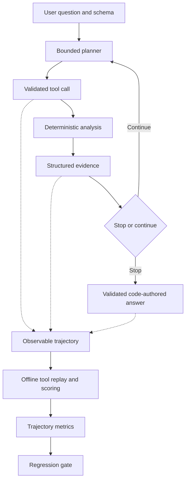

# Data QA Agent

**A reliability-focused data investigation agent combining deterministic analysis tools, bounded LLM planning, evidence-grounded answers, and trajectory-level regression evaluation.**

Upload a CSV to inspect quality, compare it against a baseline, or investigate a question. Python performs the calculations; the LLM chooses bounded analyses. Investigation answers cite collected evidence, while an offline evaluator scores real model trajectories and detects regressions.

**272 tests passing · 36 real-model scenarios · 12 golden scenarios · 156 real investigations recorded during V2.2**

The central finding: **36/36 scripted investigation regressions passed, but repeated real-model evaluation achieved only 21/108 successful runs (19.44%)** with OpenAI `gpt-4o-mini` and `planner-v2.1`. Recorded claims had **100% evidence grounding and 0% unsupported claims**, yet investigations often stopped early or missed required evidence. Grounded answers did not guarantee completed tasks.

[Measured baseline](benchmarks/baselines/investigation-v2.2/summary.md) · [Engineering case study](docs/AGENT_RELIABILITY_CASE_STUDY.md) · [Run locally](#demo--run-locally) · [Validation record](VALIDATION.md)

## Why this project exists

A plausible final answer can conceal the wrong tool, an incorrect time window, missing evidence, or failed recovery. An aggregate score can also improve while a critical task regresses. Evaluating answer provenance alone cannot resolve these failures.

This project separates deterministic computation, constrained planning, evidence validation, and trajectory evaluation. It makes tool choices, arguments, errors, stopping behavior, and task coverage inspectable. The engineering progression is explicit:

```text
Deterministic QA → drift detection → bounded investigation agent
                → real-model trajectory evaluation → regression CI
```

The implementation uses Python, pandas/NumPy, strict Pydantic contracts, Streamlit, an OpenAI SDK adapter, pytest, and GitHub Actions. Evaluation runs through the same controller and tool registry used by the application.

## What it does

| Mode | User workflow | Deterministic analysis |
|---|---|---|
| **Single Dataset QA** | Upload one CSV or explore the sample | Schema, missingness, duplicates, mixed types, numeric outliers, and constant columns |
| **Compare Against Baseline** | Compare previous and current CSVs | Schema, missingness, numeric/categorical distributions, cardinality, and datetime coverage changes |
| **Investigate Dataset** | Ask a question about one CSV | Bounded period comparisons, segment contributions, quality checks, and group contrasts |

Example questions include “Why did conversion drop in March 2024 compared with February 2024?” and “Which segment accounts for most of the revenue decline?” Questions need explicit years and clear metric semantics where applicable. Ambiguous or unsupported requests can produce clarification or partial results.

Investigation exposes registered analytical tools, without unrestricted code execution. QA and comparison work without an API key. Their optional generated explanations are separate from investigation's stricter, code-authored answers. Quality scores and drift severity are heuristic review indicators, not certifications of data correctness.

## Architecture



The controller in `agent.py` owns the loop. `agent_models.py` defines strict actions and arguments; `agent_tools.py` computes results; `agent_validator.py` checks evidence selection and sufficiency. `evals/trajectory.py` independently replays saved calls against fixed fixtures. No LLM judge is required.

## Reliability by design

| Layer | Responsibility |
|---|---|
| Deterministic Python | Statistics, aggregation, drift metrics, and evidence claims |
| LLM planner | Selects registered tools, arguments, evidence IDs, and a finish action |
| Validation layer | Checks argument shapes, columns, evidence references, and supported completion conditions |
| Controller | Enforces step, tool, error, context, and elapsed-time bounds |
| Evaluation system | Verifies saved trajectories, measures coverage, and gates regressions |

The LLM does not calculate reported statistics or supply accepted final prose. Python renders numeric claims from the evidence ledger. Strict tool schemas reject extra fields and implicit type coercion; there is no arbitrary Python, SQL, shell, or external-connector tool.

Dataset text, column names, and group labels are untrusted inputs. They can still distract planning within the allowed tools. Code-authored findings constrain fabrication, but cannot guarantee that selected periods, columns, or filters correctly interpret the question.

Default limits are **8 planning steps, 8 attempted tool calls, and 3 errors**, including the bootstrap schema call in the tool budget. A **120-second soft deadline** is checked between operations; provider requests have a 15-second timeout and no SDK retries. Repeated equivalent calls consume budget and are rejected. Exhausted limits produce explicit partial results. The interface displays observable actions, arguments, errors, and evidence, never hidden reasoning.

### Investigation tools

| Tool | Purpose |
|---|---|
| `inspect_schema` | Inspect column names, parsed types, and row count |
| `get_dataset_summary` | Summarize counts, missingness, and duplicates |
| `profile_column` | Inspect one column's quality and numeric summaries |
| `check_quality` | Check quality within a scope or across periods |
| `compare_time_periods` | Compare an explicitly selected metric between periods |
| `compare_segments` | Decompose observed change by one or two dimensions |
| `group_metric` | Aggregate groups or compare selected group values |
| `compare_distribution` | Compare numeric or categorical distributions over time |

## Real-model evaluation

**Layer 1: scripted controller/tool regression.** The 36 authored investigation scenarios exercise the real controller and deterministic tools with scripted planners. Passing these tests establishes regression coverage, not live planner reliability.

**Layer 2: repeated real-model benchmark.** Another 36 synthetic scenarios cover direct investigations, multi-step tasks, unsupported premises, ambiguity, recovery, and adversarial inputs. Twelve form the golden subset. Each declares required evidence, acceptable analysis classes, expected scope/status, prohibited claims, and call budgets. Exact action sequences need not match.

The evaluator checks tool arguments and independently recomputes evidence. It separately scores citation grounding, evidence coverage, completeness, recovery, and stopping. A mutually consistent forged answer and ledger cannot establish their own correctness. Six recovery probes inject a disclosed failing call before real model decisions; those calls count toward recovery and budgets, but not model-selection or argument-validity denominators.

### Recorded configuration and results

| Setting | Full V2.2 baseline |
|---|---|
| Model / provider | Requested `gpt-4o-mini` / `api.openai.com` |
| Planner prompt | `planner-v2.1` |
| Scenarios / repeats / investigations | 36 / 3 / 108 |
| Step / tool budget | 8 / 8 |
| Temperature / concurrency | Provider default; 3 concurrent workers |
| Capture start | 2026-10-02, 10:49:32 UTC |

| Metric | Recorded result |
|---|---:|
| Run success | **21/108 (19.44%)** |
| Scenarios passing every repeat | **4/36** |
| Tool selection accuracy | 69.01% |
| Tool argument validity | 93.32% |
| Evidence grounding | 100% |
| Evidence coverage | 43.67% |
| Unsupported claims | 0% |
| Recovery rate | 37.93% |
| Premature stop rate | 54.63% |
| Stop accuracy | 26.85% |
| Average attempted tool calls | 2.81 |

Rates are macro averages over eligible runs unless defined otherwise. Grounding covers **255 material claims across 88 claim-bearing runs**; claimless runs do not receive an invented perfect score. Recovery averages **29 runs with errors**. Six scenarios had mixed outcomes and 26 passed no repeats. See [metric definitions and denominators](docs/AGENT_EVALUATION.md).

These results are specific to the tested model, prompt, provider configuration, synthetic scenario set, and run date. The model alias is not a pinned provider revision. **156 new investigations** comprise this 108-run baseline, 36 candidate-prompt runs, and 12 budget-probe runs. The golden baseline reuses full-suite captures; it adds no new investigations.

## What the benchmark found

**The dominant failures were incomplete investigations, rather than fabricated numeric claims.** Some runs used an incorrect calendar boundary; others returned a completed status without required count/mean comparisons or joint segment analysis. Correct arithmetic did not make the selected analysis sufficient.

| Failure label | Runs |
|---|---:|
| `incomplete_answer` | 79 |
| `missing_required_evidence` | 64 |
| `premature_stop` | 59 |
| `wrong_tool` | 42 |
| `unrecovered_tool_error` | 18 |
| `wrong_arguments` | 17 |
| `repeated_tool_call` | 7 |
| `timeout` | 5 |

Counts overlap; the [full report](benchmarks/baselines/investigation-v2.2/summary.md) also records unexpected final statuses. Evaluating only final-answer grounding would miss these task and process failures. A separate two-task budget probe achieved 0/6 successful runs at both four and eight steps/calls; more available budget did not resolve those observed failures.

### A prompt improvement rejected by the gate

On identical golden tasks, `planner-v2.2` produced **11/36 successful runs**, versus **8/36** for `planner-v2.1`. But critical `conversion_device` success fell from **2/3 to 1/3**. **The regression gate rejected the candidate; the production default remains `planner-v2.1`.**

Aggregate improvement must not hide a critical regression. These small, sequential experiments do not establish a causal prompt effect or a statistically superior prompt. The [saved comparison](benchmarks/results/v22-golden-v22/summary.md) preserves both outcomes.

## Regression CI

The [Tests workflow](.github/workflows/tests.yml) runs unit tests, deterministic evaluations, lint, dependency checks, and offline replay of saved real trajectories. It checks pinned baseline scores and verifies that the known candidate regression remains detectable. Normal CI needs no paid model or external model availability.

Safety gates reject unsupported/contradicted claims, altered tool evidence, and grounding below 99%. Losing a successful repeat on a critical scenario fails regardless of aggregate gains. Other adverse changes use the larger of five percentage points or twice baseline standard error: an operational tolerance, not a significance test.

The separate [Optional real-model agent benchmark workflow](.github/workflows/agent-benchmark.yml) is manually triggered with configured secrets. It captures repeated investigations, scores trajectories, and uploads artifacts. It was implemented but not remotely executed during V2.2 validation. Frozen replay detects evaluator/tool drift; new prompt or provider behavior requires fresh real-model runs.

## Demo / Run locally

**Public Streamlit deployment is not yet verified.** Use Python 3.11:

```bash
git clone https://github.com/kaimouren/analysis_tool.git
cd analysis_tool
python -m venv .venv
```

Activate with `source .venv/bin/activate` on Linux/macOS, or `.venv\Scripts\Activate.ps1` in PowerShell, then:

```bash
python -m pip install -r requirements.txt
python -m streamlit run app.py
```

Try the built-in samples without uploading data. Investigation additionally requires `OPENAI_API_KEY`; optional settings are `OPENAI_MODEL` and `OPENAI_BASE_URL`. Configure them in the environment or through supported app configuration. `.env` is not loaded automatically. Select **Investigate Dataset**, enter a question, enable aggregate-sharing consent, and run.

Investigation sends the question, real schema names, selected group labels, and bounded aggregates to the configured provider. Those can be sensitive even without raw rows. Uploads are processed on the app server. See [security](docs/SECURITY.md) and [deployment](docs/DEPLOYMENT.md) before hosting.

### Example investigation

On the included synthetic fixture:

> Why did conversion drop in March 2024 compared with February 2024?

An illustrative supported path is schema inspection → February/March rate comparison → segmentation by device and country → cited findings. Actual model paths and completion vary.

The verified tool result is **75% → 62.5% conversion**, a **12.5 percentage-point decline**. US mobile users account for **100% of the net observed decline** in this fixture. This is an arithmetic contribution, not a causal explanation. The [worked example](docs/INVESTIGATION.md) documents the data and contracts; this path is not a promise of a successful live run.

### Benchmark commands

Install development dependencies first:

```bash
python -m pip install -r requirements-dev.txt
```

Golden and full benchmarks make paid requests using environment credentials:

```bash
python -m evals.agent_benchmark --suite golden --runs 3 --output benchmark-results/golden
python -m evals.agent_benchmark --suite full --runs 3 --output benchmark-results/full
```

Replay the shipped baseline offline, or compare a newly captured full run:

```bash
python -m evals.agent_benchmark --offline benchmarks/baselines/investigation-v2.2/runs.json --output benchmark-results/offline
python -m evals.agent_benchmark --offline benchmark-results/full/runs.json --baseline benchmarks/baselines/investigation-v2.2/runs.json --output benchmark-results/comparison
```

Comparisons require matching scenario/repetition manifests and evaluator versions. Use a fresh output directory for each live capture. Reports include canonical `runs.json`, summaries, scored trajectories, failures, and regression decisions where requested.

Run local regression checks:

```bash
python -m pytest -q
python evals/investigation.py
python -m evals.benchmark_ci
```

## Version evolution

| Version | Focus |
|---|---|
| V1 | Deterministic single-dataset QA |
| V1.1 | Robustness and red-team hardening |
| V1.2 | Release engineering and CI |
| V2 | Baseline comparison and drift |
| V2.1 | Bounded investigation agent |
| V2.2 | Real-model evaluation and regression CI |

The current portfolio scope is complete through V2.2. The [validation record](VALIDATION.md) documents **272 passing tests on Windows and Linux**, plus deterministic and scripted evaluation results, separately from live-model performance.

## Limitations

- Scenarios are synthetic and manually designed; three repeats per scenario do not establish population reliability.
- Results depend on model, provider, prompt, and runtime configuration. Strict scope selectors and accepted tool classes may penalize alternative reasonable paths.
- Evidence provenance does not guarantee relevance, completeness, universal semantic correctness, or causal inference.
- Arbitrary Python execution is deliberately unavailable. Rates require binary data; period analysis requires explicit years; median decomposition is unsupported.
- CSV type inference can lose representation details. Quality scores and drift thresholds are uncalibrated heuristics.
- Optional QA/comparison prose has weaker validation than investigation answers and can still be wrong.
- No verified public deployment, tenant-isolation guarantee, per-user quotas, or production load validation is claimed.
- Estimated cost is unavailable; no cost benchmark or pricing-derived total is reported.

## Technical docs

| Document | Read for |
|---|---|
| [Agent evaluation](docs/AGENT_EVALUATION.md) | Metric definitions, artifact contracts, CLI, and gate policy |
| [Reliability case study](docs/AGENT_RELIABILITY_CASE_STUDY.md) | Experiments, discovered failures, and engineering lessons |
| [Investigation architecture](docs/INVESTIGATION.md) | Tool contracts, math, limits, privacy, and worked example |
| [Investigation red team](docs/V2_1_RED_TEAM.md) | Controller and evidence-boundary probes |
| [V2 red team](docs/V2_RED_TEAM.md) | Comparison robustness and adversarial findings |
| [Drift methods](docs/V2_DRIFT.md) | Distribution metrics, thresholds, and interpretation limits |
| [QA checks](docs/CHECKS.md) | Detection rules, severity, and false-positive risks |
| [Validation evidence](VALIDATION.md) | Recorded tests, environments, and release checks |

Portfolio materials: [project summary](docs/PORTFOLIO_SUMMARY.md), [resume bullets](docs/RESUME_BULLETS.md), [interview story](docs/INTERVIEW_STORY.md), and [technical Q&A](docs/INTERVIEW_QA.md).

Licensed under [MIT](LICENSE).
