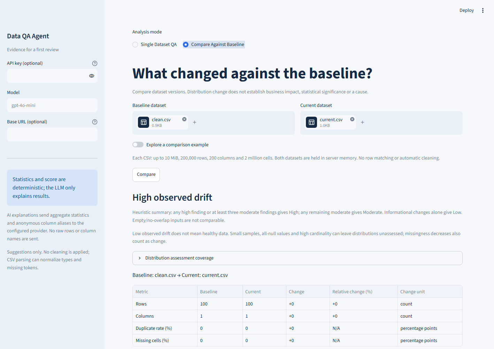
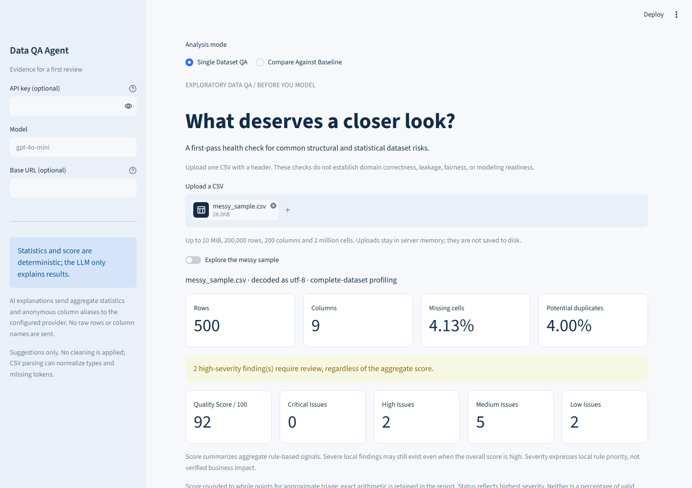
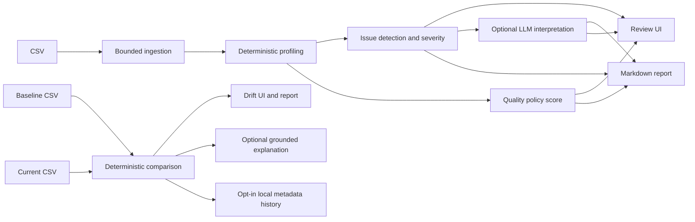

# Data QA Agent

**A deterministic-first CSV health check that surfaces common structural and statistical risks before modeling, with optional LLM explanations.**

V2 adds **baseline comparison and data drift analysis**. Keep the existing health check, or compare a previous CSV with a current CSV. Python computes all evidence, metrics, ordering and severity; optional generated text only explains that evidence.

## Compare against a baseline (V2)

Select **Compare Against Baseline**, upload **Baseline dataset** and **Current dataset**, then click **Compare**. A built-in example works without files or a provider key. Results include schema, row/column counts, missingness/duplicates, cardinality, numeric/categorical distributions and conservative datetime coverage, with shared-column details and Markdown download.

An illustrative review might compare 100k January customer records with 95k February records and reveal mobile share +18 percentage points, email missingness +12 percentage points, and a downward revenue distribution shift. These observations do not establish why changes happened or whether they are harmful.

Numeric comparison uses KS distance; categorical comparison uses total variation distance. Missingness differences are **percentage points**. Zero denominators show N/A. Low/Moderate/High observed drift is a heuristic, not a calibrated probability or quality score. Low drift can coexist with unhealthy or unassessed data.



The independent API is:

```python
from comparison import compare_datasets
result = compare_datasets(baseline_df, current_df)
```

All rows are analyzed. High-cardinality category details are suppressed; small-sample distances receive no distribution severity. Finite numeric magnitudes over 1e150 are rejected. Read [V2 methods, thresholds, schema and limitations](docs/V2_DRIFT.md).

Optional **local run history** stores metadata only. On a trusted single-user installation, set `QA_HISTORY_PATH` to `.qa-history/comparisons.sqlite3`, restart, and use **Save run to local history**. Recent history retains 50 entries. Leave the variable unset on public deployments: server-local history is not isolated between visitors. Raw datasets, category values and generated prose are never stored. Derived baseline snapshots are deferred; direct file comparison is supported.

## Live Demo

Public deployment: **Not verified**. No public URL is claimed. Run locally and select **Explore the messy sample**.



## Why it exists

A new CSV often needs a quick first review before deeper analysis: which observations deserve attention, what rule flagged them, and what to investigate next. This tool connects reproducible measurements, explicit review priorities and portable reports. It does not replace domain review or a declared validation contract.

## Quickstart

Clone the repository and use Python 3.11:

```bash
git clone https://github.com/kaimouren/analysis_tool.git
cd analysis_tool
python -m venv .venv
```

Activate with `source .venv/bin/activate` on Linux/macOS or `.venv\Scripts\Activate.ps1` in PowerShell:

```bash
python -m pip install -r requirements.txt
python -m streamlit run app.py
```

No API key is needed. Upload a comma-delimited CSV with a header or try the bundled sample. Paths resolve relative to the application file, not a particular operating-system username or working directory.

## Architecture

**Code calculates. The LLM explains.**



`ingestion.py` validates input and retains bounded pre-inference examples. `qa_core.py` computes statistics, findings, severity and score using `policy.py`; `analysis.py` adds run metadata and safe errors. `llm.py` contains optional prose and authored fallback. `app.py`, `presentation.py` and `report.py` present results. Effective thresholds and profile/score versions accompany the report; timestamps do not affect deterministic results.

V2 reuses ingestion and adds `comparison.py` for structured comparison, `drift.py` for metrics/policy, `comparison_llm.py` for optional interpretation, `comparison_ui.py` for presentation/export, and `history.py` for explicit metadata saves. No dependency was added.

## What the score means

The score is an **uncalibrated aggregate heuristic policy indicator**. Severity is a **local rule priority**, not inferred business importance. They answer different questions and are displayed separately: Quality Score, Critical Issues, High Issues, Medium Issues and Low Issues. Critical/high findings remain prominent regardless of the score. No reassuring score band hides them.

One completely missing column among 200 can score **99.85** while producing a critical finding. Hundreds of advisory formatting warnings can score **100** because those checks are unscored. Neither result certifies correctness or full model readiness. The headline rounds to whole points; exact arithmetic stays in the report. The bundled sample computes **92.36**, displayed as **92**.

Default score policy 1.0 starts at 100 and subtracts these category penalties:

| Category | Penalty | Cap |
|---|---|---:|
| Missingness | `30 * missing_cells / all_cells` | 30 |
| Exact duplicates | `20 * repeated_rows_after_first / rows` | 20 |
| IQR outliers | `15 * min(1, 5 * eligible_outliers / all_finite_native_numeric_values)` | 15 |
| Constant columns | `15 * constant_columns / columns` | 15 |
| Near-constant columns | `5 * near_constant_columns / columns` | 5 |
| Possible IDs | `3 * possible_id_columns / columns` | 3 |
| Mixed parser results | `12 * mixed_columns / columns` | 12 |
| Infinities | `10 * infinite_values / all_cells` | 10 |

IQR score eligibility requires at least 1% flagged values in that numeric column. Zero denominators contribute zero. Category penalties round to six decimals; the final `max(0, 100 - penalties)` rounds to two. Empty datasets add a 100-point penalty. Constants and near-constants are exclusive; other signals overlap. Weights are engineering policy choices, not calibrated estimates. Width can dilute local defects; scores across unrelated datasets are not universal rankings.

Worked example: six rows with `x=[0,1,2,3,100,missing]` and one constant group column incur 2.5 missingness + 15 outliers + 7.5 constant + 1.5 possible-ID penalties, giving **73.5**. See [scoring stress tests](docs/SCORING_STRESS_TEST.md), [threshold sensitivity](docs/THRESHOLD_SENSITIVITY.md) and [exact definitions](docs/profiling.md).

## What the tool checks

- pandas-null missingness, including completely empty columns
- exact repeated rows after the first occurrence
- mixed numeric/date parseability in text columns
- IQR-flagged finite numeric values and explicit infinities
- constant, near-constant and high-cardinality/possible-ID columns
- blank strings, surrounding whitespace and potential casing variants (advisory, unscored)
- empty datasets and bounded input preconditions

Every finding includes its observed statistic, evidence, detection/severity rule and category: structural validation failure, statistical anomaly or heuristic warning. Severity boundaries, rationale and false-positive risks are documented in [CHECKS.md](docs/CHECKS.md). Ranking is severity, issue type, then column name. No cleaning is applied.

## What the tool does NOT prove

It does not establish semantic correctness, target leakage, fairness, causality, production readiness, domain validity, model fitness or absence of all data issues. Repeated events, negative accounting adjustments, constant metadata and future test dates can be legitimate. Suggestions require context.

## LLM trust boundary

1. **Deterministic evidence:** code-derived counts, rates, observed examples and score arithmetic.
2. **Heuristic detection rules:** explicit policy thresholds and cautious interpretations of those observations.
3. **Optional generated interpretation:** labeled prose with **Generated interpretation. Verify before acting.**

The model cannot replace findings, severity, ranking or score. Requests contain allowlisted aggregate fields and anonymous column aliases, not raw values or real column names. Schema, issue-order and narrow lexical checks reject some invalid responses. **There is no semantic-verification guarantee for LLM prose.** Paraphrased invented facts, unsupported causes and contradictions can still pass. Rejected responses use authored guidance; deterministic cards and export remain available. See [LLM failure modes](docs/LLM_FAILURE_MODES.md).

Provider calls occur only on the explanation button, with a 25-second timeout, no SDK retries and a 2,000-token completion cap. No suggestions execute transformations.

## CSV representation and privacy

CSV parsing itself can normalize values: `00123` may become `123`, `NA`/`null` may become missing, and numerical precision depends on inferred dtype. Date-looking strings are not automatically converted by this loader; the separate semantic date heuristic can still interpret ambiguous dates incorrectly. Currency/percentage strings may remain text.

For suspicious or mixed columns, the explorer shows up to **three distinct decoded tokens, 80 characters each, from the first 100 logical records**, prioritizing recognized lexical risks within that window. These are pre-pandas field values, not original quote syntax or lossless bytes; they can miss later anomalies and are not row-aligned with parsed statistics. They do not change score or detection. Samples remain in server-session memory and are excluded from LLM requests, logs and Markdown exports. See [CSV inference](docs/CSV_INFERENCE.md).

Hosted uploads reach the hosting server even without AI. This application does not deliberately persist uploads, but host swap, crash dumps and telemetry are outside that guarantee. Reports retain column names. Aggregates can still be sensitive. Read [SECURITY.md](docs/SECURITY.md).

## Configuration and deployment

Nonblank sidebar input takes precedence over environment variables, then Streamlit secrets; unavailable credentials select authored guidance. Supported settings are `OPENAI_API_KEY`, `OPENAI_BASE_URL` and `OPENAI_MODEL` (default `gpt-4o-mini`). `.env.example` is a reference; `.env` is not auto-loaded. Never commit `.env` or `.streamlit/secrets.toml`.

Browser-selected provider endpoints must match the administrator allowlist (default OpenAI endpoint, configured server endpoint, or environment-only `QA_ALLOWED_LLM_BASE_URLS`). A different endpoint also requires a visitor's own key. A shared server key exposes its owner's API budget; no per-user quotas exist.

Input guards: **10 MiB, 200,000 rows, 200 columns, 2 million cells, 256 MiB deep frame memory, 65,536 characters per text cell**. These are conservative per-input limits, not measured hosted capacity or a process-memory ceiling. Native finite magnitudes over 1e150 are rejected with rescaling guidance. Data is analyzed in memory; oversized input is rejected rather than silently sampled.

See [DEPLOYMENT.md](docs/DEPLOYMENT.md) for exact GitHub publication, remote Actions verification, Community Cloud setup, secrets and post-deployment checks. Remote GitHub Actions: **verified successful** for published source `6c6c5d2` ([run evidence](https://github.com/kaimouren/analysis_tool/actions/runs/36290414830)). Public Streamlit deployment: **Not verified**.

## Performance

V1.2 measured snapshot: Windows, Python 3.11.3, pandas 2.3.3, NumPy 2.4.6, eight logical CPUs, eight mixed columns; one fresh process per size. RSS sampled every 5 ms includes imports/input and can miss brief peaks. Core timing excludes CSV ingestion, charts and LLM calls. Background dependency setup was active; these are single observations, not an isolated performance comparison.

| Rows | Core runtime | Sampled peak RSS |
|---|---:|---:|
| 500 | 0.0446 s | 76.80 MiB |
| 10,000 | 0.1865 s | 82.22 MiB |
| 100,000 | 1.5487 s | 126.20 MiB |

Machine-specific observations, not latency percentiles or hosted capacity guarantees. [Recorded snapshot](benchmarks/v1-2-results.json); other current-release checks are listed in [VALIDATION.md](VALIDATION.md).

```bash
python benchmarks/benchmark.py
python benchmarks/adversarial.py
```

Public ingestion/profiling entry points serialize within one process. Python 3.11 warning filters are global, and pandas/NumPy modify them inside common operations; narrowing only CSV/date locks previously leaked filters. Queueing trades throughput for predictable state. Retained/queued session data can still exhaust memory. The evidence and decision are in [CONCURRENCY.md](docs/CONCURRENCY.md).

## Testing

```bash
python -m pip install -r requirements-dev.txt
python -m pip check
python -m pytest -q
python -m ruff check .
python evals/run.py
python evals/behavioral.py
python evals/stress.py
python evals/comparison.py
```

Tests cover numerical examples, boundary conditions, parser failures, raw-sample bounds/privacy, dual score/severity UI, provider fallback, reproducibility and concurrency restoration. Eight synthetic fixtures and five fictional export scenarios provide regression/behavioral coverage, not population accuracy. Ten scoring stress cases expose misleading aggregate interpretations. Five controlled mutations were caught by assertions; optional browser tests exercise real uploads, charts and report downloads.

[VALIDATION.md](VALIDATION.md) records current counts, environments and exact results. CI is configured for tests, lint, dependency consistency and evaluations. Configured CI, locally executed checks and remotely successful GitHub Actions are distinct claims.

## Limitations

- Heuristic rules and weights are uncalibrated and can overlap or dilute local defects.
- CSV inference is lossy; bounded source examples cannot recover an entire file or establish intended types.
- Latin-1 fallback cannot prove original encoding. Short records can be null-padded; missing conventions are pandas defaults.
- Large-integer extrema retain parsed integers; means, quantiles and IQR workspace remain approximate float64 calculations.
- The global lock protects application analysis entry points, not arbitrary third-party threads or multi-process hosts.
- No identity, request quotas, bounded admission, cancellation policy, tenant-isolation guarantee or production browser-load validation exists.
- LLM prose can be wrong even after validation; live-provider compatibility is not guaranteed.
- Dependency ranges are constrained but not a complete transitive lockfile; rerun validation when upgrading.

## Roadmap

The next candidate is **explicit data contracts**: declared types, missing-value conventions, uniqueness/key rules and business constraints. This would make intent explicit rather than adding more guesses. It is not implemented in V1.2.

No automatic cleaning, model training, target selection, external database, background jobs, authentication or monitoring platform is included. V2 adds optional local SQLite metadata history. See [V2 methods](docs/V2_DRIFT.md), [historical V1.2 release notes](docs/RELEASE_V1_2.md) and [interview guide](docs/INTERVIEW_GUIDE.md).

## License

[MIT](LICENSE).
