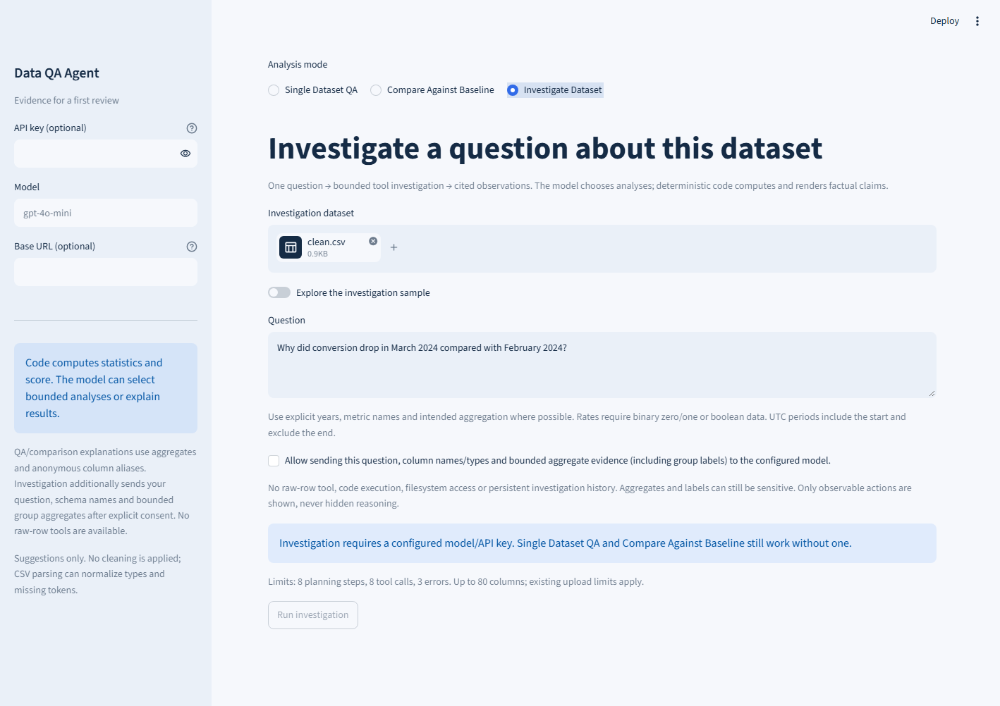
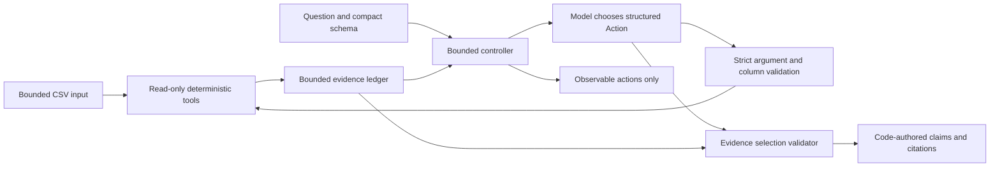

# V2.1 Investigation Agent

V2 answers what changed between two CSVs. V2.1 lets a configured model choose a
bounded sequence of deterministic analyses for one question about one CSV.
It does not execute Python/SQL, clean data, browse, write files, retain conversation
memory, infer causes, forecast, or provide a significance test.

## Running an investigation

Select **Investigate Dataset**, upload a CSV or enable the synthetic sample, and
enter a question with explicit years and intended metric semantics. Configure a
model using the existing sidebar/environment/secrets mechanism. Read and enable
the aggregate-sharing consent, then click **Run investigation**. Without a key,
the button stays disabled; deterministic QA/comparison still work. There is no
scripted production fallback. The result includes status, code-authored cited
findings, observable actions, exact arguments, limitations and a JSON download.
Changing the question or input clears the previous result. Nothing is saved to
comparison history automatically.

Example on the included 320-row fixture:

> Why did conversion drop in March 2024 compared with February 2024?

1. Controller inspects schema.
2. Planner selects `compare_time_periods`, binary `rate`, February versus March.
3. Planner selects `compare_segments` by device and country; it may inspect device
   alone first or narrow to mobile before a country comparison.
4. Planner selects existing evidence IDs and finishes.

Code finds conversion **0.75 → 0.625**, a **12.5 percentage-point decline**, with
160 valid values in each period. US mobile changes **0.75 → 0.25**, contributing
**-12.5 percentage points**, or **100% of the net observed decline**. These are
arithmetic contributions in the chosen data, not underlying causes. Model actions
are not guaranteed to follow this exact sequence; inspect the trace and status.

## Architecture and trust boundary

`agent.py` owns orchestration and the small `Planner.next_action(context)` seam.
`OpenAIPlanner` reuses the installed SDK and
[structured outputs](https://developers.openai.com/api/docs/guides/structured-outputs),
requesting the `Action` Pydantic schema. It never receives the DataFrame or runtime
credentials in its context. Model calls use the configured provider endpoint;
tools themselves have no external-call capability. Compatible providers must
support the installed SDK's `chat.completions.parse` and schema/token parameters.

`agent_models.py` defines strict arguments and limits. `agent_tools.py` deep-copies
the input, clears parser attributes, reuses V1 profiling/V2 comparison and the
shared analysis lock, and owns new period/group arithmetic. No package was added.
`agent_validator.py` checks selection/sufficiency and renders claims.
`investigation_ui.py` handles consent, input, trace and export.

The model returns **only actions and evidence IDs**, never accepted final prose.
Extra answer/rationale fields are rejected. Consequently fabricated model
numbers, causal stories, significance claims and altered evidence cannot be
rendered as findings. This is a stricter boundary than V1/V2 optional prose.
It does **not** prove that model-selected columns, filters, aggregation or periods
faithfully interpret an arbitrary question. Those arguments remain visible.

## Tool catalog and result contracts

All arguments forbid extra fields and implicit type coercion. Column arguments
must exist exactly. Missing columns produce up to three suggested names, never
automatic substitution. Filters are at most two exact string equalities; they
are not expressions or query code. Missing cells never match literal strings
such as `"None"` or `"nan"`. Periods are optional only where noted below.

| Tool | Arguments / purpose |
|---|---|
| `inspect_schema` | No arguments; row count, names and parsed dtypes; no rows |
| `get_dataset_summary` | No arguments; overall counts, missingness and duplicates |
| `profile_column` | `column`; type, non-null/unique counts, missingness and numeric summaries; no examples |
| `check_quality` | Optional `periods`, `filters`; whole-scope quality or V2 period differences |
| `compare_time_periods` | `metric_column`, explicit `aggregation`, `periods`, optional `filters` |
| `compare_segments` | Same plus one/two `segment_columns`; additive decomposition |
| `group_metric` | Metric and dimensions, optional filters; whole-scope aggregates; optional paired `left_value`/`right_value` for one-dimension contrasts; no periods |
| `compare_distribution` | `column`, `kind` numeric/categorical, `periods`, optional `filters` and categorical `category`; V2 KS/TVD and optional category counts |

Successful result schema: `{status: "ok", tool, args, values, claims, eligible}`.
`args` contains normalized validated arguments, `values` is a JSON object with
tool-specific metrics, `claims` is a list of `{claim_type, text, values}`, and
`eligible` is a Boolean sufficiency guard. The controller adds `evidence_id`
(`ev_01`, etc.). Final claims add `claim_id` and `evidence_id`; the UI cites them.
Only bounded, strict JSON results are accepted; non-finite values are not JSON.

Errors have `{status: "error", error_type, message, recoverable: true, details}`.
Examples: `missing_column`, `wrong_dtype`, `invalid_arguments`, `invalid_dates`,
`empty_period`, `too_many_groups`, `result_limit`. Provider/internal exception text
is not copied into results. Recoverable means another supported analysis may
work; it does not promise recovery. The planner receives the structured error.

Investigation results contain `question`, `status`, `steps`, `tool_calls`,
`evidence`, `answer`, `claims`, `limitations`, `stop_reason`, `metrics`, effective
`limits` and `investigation_version`. Status is `completed`, `partial` or `failed`.
`completed` means the supported descriptive checks passed sufficiency guards,
not semantic correctness, statistical confidence or exhaustive explanation.

## Time, metrics and decomposition

- Periods are ordered non-overlapping UTC **[start, end)** intervals. Inputs use
  year-first ISO dates/timestamps; timezone-aware timestamps convert to UTC.
  Question years must explicitly cover boundaries, with Jan 1 of the next year
  allowed as an exclusive endpoint. No automatic "March means this year" rule.
- Missing/malformed/ambiguous non-year-first dates are excluded and counted in
  evidence. Completely unparseable columns and empty periods return errors.
  A valid date outside both chosen periods is outside scope, not malformed.
- `count` means **non-null metric observations**, not necessarily number of rows
  or orders. `sum`, `mean`, `median` use finite native numeric values; numeric
  strings are not coerced. `rate` requires binary 0/1 or Boolean values and is
  their mean. Missing/non-finite metrics are excluded; counts expose exclusions.
  Denominator-zero relative changes remain null. Rates distinguish proportions,
  relative percentages and percentage-point change.
- For sum/count, segment contribution is current group total minus baseline
  group total. For mean/rate it is **current group sum / current overall valid N
  minus baseline group sum / baseline overall valid N**. Thus contributions
  incorporate population composition and within-group changes; this is not a
  causal or within-group-only decomposition. Median decomposition is rejected.
- Contributions must reconcile to aggregate delta within 1e-9 relative/absolute
  tolerance. Top groups are sorted in the direction of net change; omitted groups
  become a distinct `Other (aggregated tail)` object, not a real category.
  Net-zero change has no contribution share; offsetting effects can yield negative
  shares or shares over 100%. Integer sums retain Python integer arithmetic;
  mean/median, relative changes and reconciliation use approximate float64.
- Distinct typed groups with identical display labels are rejected. Groups can
  include a distinct missing-label bucket. Long labels fail rather than becoming
  indistinguishable truncated values. No assumed currency or business units.

## Premises, stopping and limits

A narrow English/Chinese direction recognizer compares the observed sign with
the stated increase/decrease premise. It reports supported, contradicted or
inconclusive. Both/neither directional cues are inconclusive. An explicit group
contrast requires the left group to occur literally in the question. Small
samples never establish a directional premise.

Primary findings cannot be cherry-picked out by the model's final selection.
For a supported "why/segment" question, the first eligible period comparison
anchors the analysis and requires a matching decomposition (same metric,
aggregation, filters and periods). A contradicted anchor can stop without a
forced explanation. An unrelated later contradiction cannot bypass the anchor.
Quality-plus-metric questions require both kinds of evidence; temporal quality
questions cannot finish using only a whole-dataset quality check. These are
explicit heuristics, not a general natural-language entailment engine. Open-ended,
multilingual and multi-metric requests may be incomplete or misinterpreted.

| Default bound | Value |
|---|---:|
| Planning steps / attempted tool calls | 8 / 8 (bootstrap schema counts as a call) |
| Recoverable errors | 3, including rejected actions/finishes |
| Per-tool JSON / total planner context | 16,000 / 64,000 ASCII-serialized characters |
| Group support / shown groups | 100 / top 10 plus aggregate tail |
| Eligible valid observations | 20 per comparison side and nonempty segment side |
| Investigation columns / name and group label length | 80 / 80 characters |
| Question / serialized argument object length | 2,000 / 6,000 characters |
| Elapsed budget / provider request timeout | 120 / 15 seconds, no SDK retries |
| Provider output cap | 1,800 tokens per request |

`AgentLimits` allows positive integer overrides through the Python API; the UI
uses conservative defaults. Existing upload/cell/memory/magnitude guards apply.
Exact repeated calls are rejected before execution, still consuming attempted
call/error budget. Limits stop with explicit partial status. Elapsed checks run
between synchronous operations; this is a **soft** deadline, not process
preemption, network byte protection or a memory isolation guarantee.

## Privacy and security

Consent covers the question, real column names/types, selected group labels,
periods, tool arguments and bounded aggregate evidence. These can be sensitive,
especially for small groups. No differential privacy guarantee or raw-row tool
exists. Parser samples are cleared; unselected text cells do not reach the model.
Question/schema/category strings remain untrusted data. Prompt instructions are
supplemented by an allowlisted tool registry, strict arguments, copied planner
contexts and code-authored claims. Injection can still distract planning within
the permitted analytical capabilities. No shell, filesystem, secret-reading,
external connector or mutation capability is exposed to the model.

Trace contains observable actions/errors/evidence only, never hidden reasoning.
It remains in session memory; explicit downloads contain labels and aggregates.
Approved-provider configuration and shared-key cost risks remain as in V2.

## Eval methodology and metric definitions

Run `python evals/investigation.py`. The 36 authored scenarios use **scripted test
planners with error-feedback checks**, the real controller and real tools. Each
defines expected status/findings, acceptable analyses, forbidden claim types,
expected errors and call budget. Cases cover all 30 requested categories plus
ambiguous years, forbidden tools, extra executable arguments, repeated calls,
injection and numeric distribution. Unit tests add adversarial finish/context
mutation, timing, label ambiguity, reconciliation and UI checks.

These metrics characterize this regression corpus; **Tool Selection Accuracy
does not measure live LLM selection/generalization**. Live smoke outcomes are
reported separately and do not enter these denominators.

| Metric | Definition | Recorded result |
|---|---|---:|
| Task Success | Scenario satisfies numeric/structured findings, status, tools, recovery and grounding expectations | 36/36, 100% |
| Tool Selection Accuracy | Successful analyses stay in acceptable classes and completed cases include required classes | 36/36, 100% |
| Tool Argument Validity | Attempted registered calls satisfying strict typed shape, including bootstrap; column existence/dtype are separate execution checks | 98/101, 97.03% |
| Evidence Grounding | Final claim objects exactly equal a tool-ledger claim with its citation | 102/102, 100% |
| Unsupported Claim Rate | Final claims without that exact mapping | 0/102, 0% |
| Recovery Rate | Intentionally recoverable completed scenarios encounter expected error and subsequently meet all success checks | 8/8, 100% |
| Efficiency | Investigations stay within authored useful-call budget, including deliberate bad attempts | 36/36, 100%; mean 2.81 calls |
| Stop Accuracy | Status matches expected complete/partial/failed outcome | 36/36, 100% |

The three intentionally invalid/unknown calls explain argument validity below
100%. CI requires every scenario and at least 96% typed-argument validity;
strict equality grounding and forbidden-claim assertions are mandatory. It also
runs the independently authored adversarial tests, all V1/V2 suites, lint and
dependency checks. Expected guarded failures count as successful scenarios, not
completed investigations. Grounding verifies provenance, not whether a finding
answers the intended human question. No style/exact answer-text matching.

Machine-readable observations: [investigation-results.json](../evals/investigation-results.json).
Execution environments/live outcomes: [VALIDATION.md](../VALIDATION.md).
